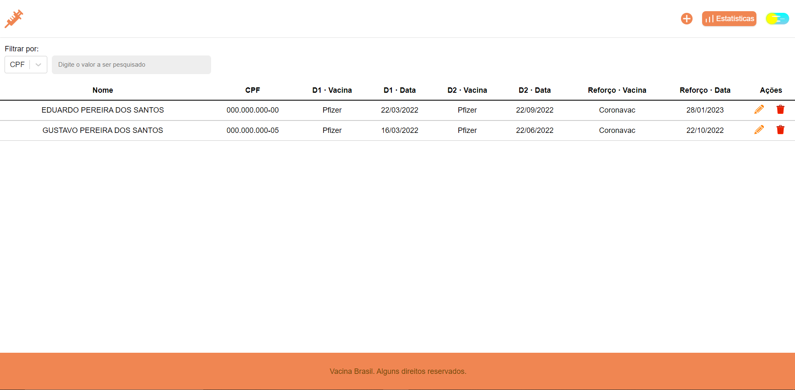
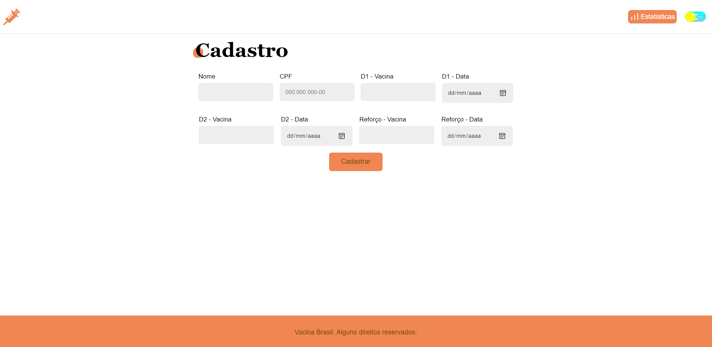
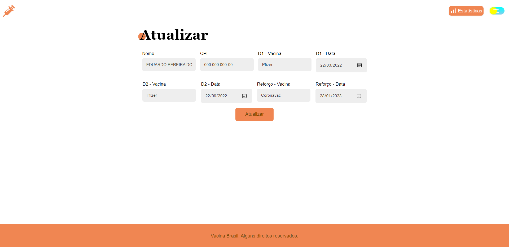
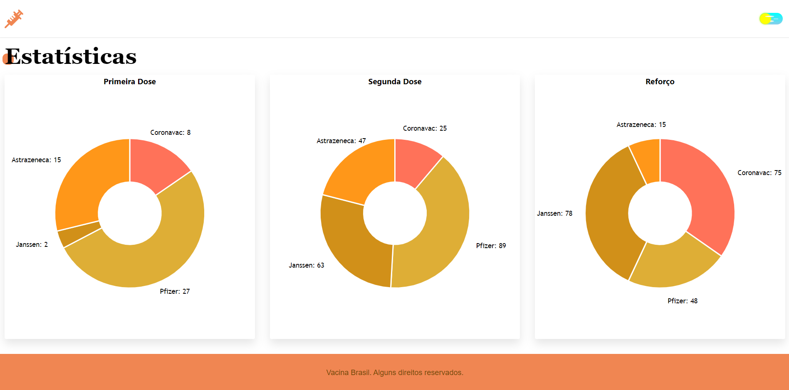
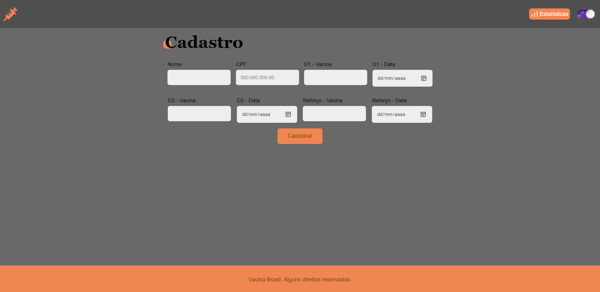

# Vacina Brasil 👋

<a>
  
</a>

O Vacina Brasil é uma aplicação web para gerenciar o processo de vacinação contra a COVID-19.

## Funcionalidades

- Listagens de usuários
- Busca por nome e CPF dos usuários
- Cadastro de usuários
- Alteração de cadastro e atualização da vacina
- Fornecimento de estastísticas

## VacinaBrasil API

Você pode instalar as dependências usando `yarn`. Execute:

```
$ yarn install
```

Para iniciar a aplicação:

```
$ yarn start
```

As requisições devem seguir os padrões:

### Usuários

| Método | Endpoint | Descrição |
|---|---|---|
| `GET` |`/users`|Retorna todos os usuários cadastrados. |
| `GET` |`/users/:id`|Retorna as informações de um usuário. |
| `POST` |`/users`| Cadastra um novo usuário. |
| `PUT` |`/users/:id`| Atualiza as informações de um usuário. |

### Estatísticas


| Método | Endpoint | Descrição |
|---|---|---|
| `GET` |`/stats`|Retorna as estatísticas. |


#### Dados para envio no POST

| Parâmetro | Descrição                | Obrigatório |
| --------- | ------------------------ | ------------
| `name`    | Nome completo do usuário | Sim
| `cpf`     | CPF do usuário.          | Sim
| `first_dose_vaccine`     | Nome da Vacina - D1.          | Não
| `first_dose_date`     | Data da Vacina - D1.          | Não
| `second_dose_vaccine`     | Nome da Vacina - D2.          | Não
| `second_dose_date`     | Data da Vacina - D2.        | Não
| `third_dose_vaccine`     | Nome da Vacina - Reforço.          | Não
| `third_dose_date`     |  Data da Vacina - Reforço.         | Não

- Body (Exemplo)

            {
              "name": "Eduardo Pereira dos Santos",
              "cpf": "000.000.000-00"
            }
            
## VacinaBrasil Site

O site também utiliza `yarn`. Execute:

```
$ yarn install
```

Para iniciar a aplicação:

```
$ yarn start
```

Para executar os testes:

```
$ yarn test
```
### Páginas

- Página Principal

 
 
- Tela de Cadastro

 

- Página de Atualização

 

- Página de Estatísticas

 

- Tema Dark

 

